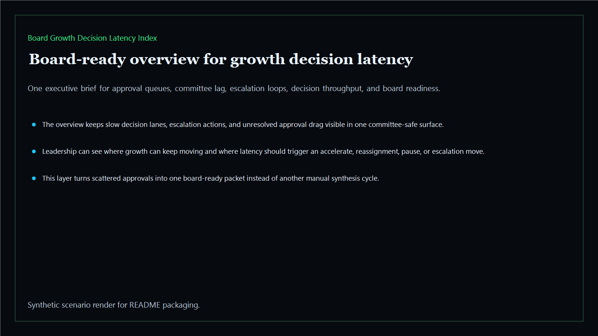
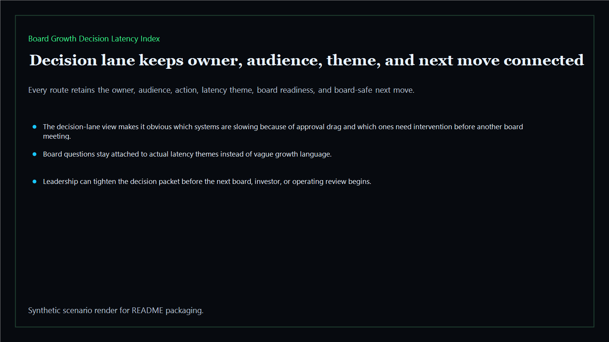
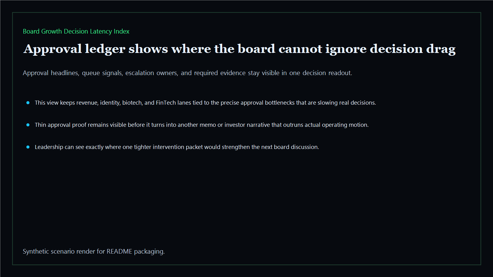
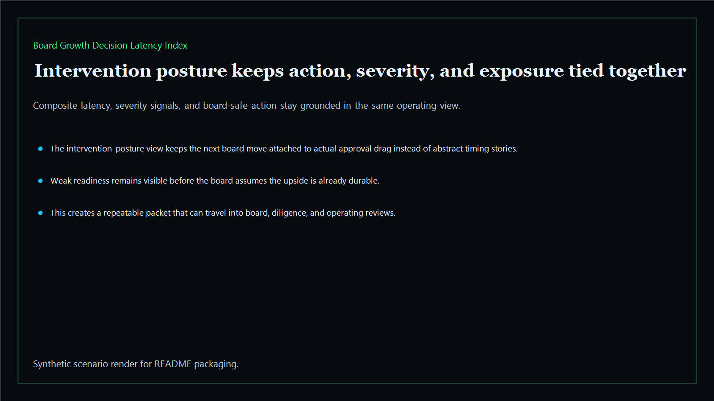

# Board Growth Decision Latency Index

Board-ready growth decision latency surface for approval drag, committee lag, escalation loops, and board-visible decision speed across the executive estate.

- Live: `https://latency.kineticgain.com/`
- Repo: `mizcausevic-dev/board-growth-decision-latency-index`

## Why this matters

Leaders need more than a growth plan. They need one surface that shows where approvals, escalations, and committee lag are slowing the upside before the board funds the next step.

## What it includes

- TypeScript executive-intelligence surface for growth decision latency with modeled approval lanes, delay signals, escalation pressure, and board-safe intervention posture
- synthetic executive lanes across AI, identity, revenue, FinTech, biotech, procurement, and public-sector readiness
- reusable outputs for latency briefs, approval ledgers, intervention packets, and board-ready decision memos
- prerendered static site, JSON payloads, screenshots, and docs

## Routes

- `/`
- `/decision-lane`
- `/approval-ledger`
- `/intervention-posture`
- `/verification`
- `/docs`

## Local run

```bash
cd board-growth-decision-latency-index
npm install
npm run verify
npm run prerender
npm run render:assets
```

## CLI

```bash
npx board-growth-decision-latency-index fixtures/board-growth-decision-latency-index.json --format summary
npx board-growth-decision-latency-index fixtures/board-growth-decision-latency-index-clean.json --format json
```

## Docs

- [Architecture](docs/architecture.md)
- [Origin](docs/ORIGIN.md)
- [Kinetic Gain Embedded](docs/KINETIC_GAIN_EMBEDDED.md)

## Screenshots





